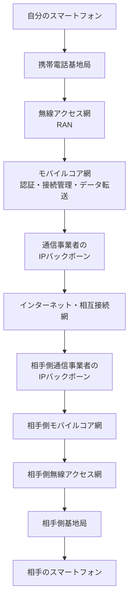
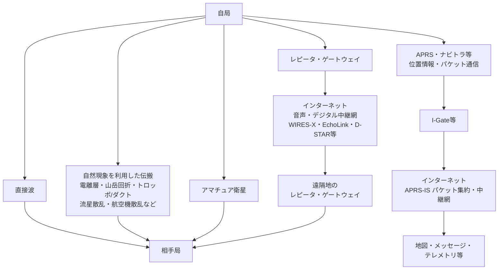

# アマチュア無線とは

アマチュア無線は、電波を使って人と通信したり、アンテナや無線機を作ったり、電波の飛び方を調べたり、新しい通信方式やソフトウェアを試したりするための、**個人向けの無線通信・技術実験の世界**です。

条件がそろえば、数Wの送信機と簡単なアンテナで海外と交信することもできます。人工衛星を使った通信、月面反射（EME）、デジタル通信、画像伝送、位置情報、無線機やアンテナの自作、SDRによる信号解析など、遊び方はかなり広い範囲に及びます。

一方で、

> 無線機を買えば、いつでも誰とでも世界中につながる。

というサービスではありません。

相手がいなければ誰も返事をしません。山や建物で届かなくなります。季節や時間によって電波の飛び方が変わります。ノイズや混信にも影響されます。

しかし、アマチュア無線では、**その不便さの原因まで自分で調べ、工夫し、変えていくことができます。**

スマートフォンやインターネットが「完成した通信サービスを使う世界」だとすれば、アマチュア無線は「通信そのものを触って遊べる世界」に近いものです。

---

## 100年以上続いている、電波実験の遊び場

無線通信が実用化され始めた19世紀末から20世紀初頭には、職業的な技術者だけでなく、個人の実験家も受信機や送信機を作って電波を飛ばしていました。

当時の無線機は、現在のように完成品を買って電源を入れるものではありません。回路、発振器、受信機、アンテナなどを自分で作り、電波が届くかどうかを試すこと自体が実験でした。

1910年代には各国で無線局の免許制度や周波数の整理が進み、アマチュアの活動も制度の中へ組み込まれていきます。

1920年代になると、アマチュア無線家たちは、当時それほど有用ではないと思われていた短波帯で、非常に遠距離まで電波が届くことを実験によって示しました。短波は電離層によって反射・屈折し、条件によって大陸や海を越えて届きます。

1925年には、各国のアマチュア無線団体が協力するため、パリで **IARU（International Amateur Radio Union）** が設立されました。

1927年の国際無線電信会議では、アマチュア無線のための周波数帯が国際的に確保され、その後も技術の発展とともに、短波からVHF、UHF、マイクロ波、衛星通信まで活動範囲が広がっていきました。

アマチュア無線は、昔の通信方法がそのまま保存されているだけの趣味ではありません。

真空管からトランジスタ、IC、マイコン、DSP、SDR、デジタル通信、人工衛星へと、その時代の技術を取り込みながら形を変えてきた趣味です。

---

## 国際的には、正式な「無線通信業務」の一つ

アマチュア無線は、単なる愛好家同士の私的な慣習ではありません。

国際電気通信連合（ITU）の **Radio Regulations（無線通信規則）** では、アマチュア業務（amateur service）が正式な無線通信業務の一つとして定義されています。

ITUの定義では、おおまかに、

- 自己訓練
- 相互通信
- 技術的研究
- 個人的な目的
- 金銭上の利益を目的としないこと

がアマチュア業務の中心に置かれています。

人工衛星を利用する **amateur-satellite service（アマチュア衛星業務）** も別に定義されています。

つまり国際的にも、

> 趣味だから適当に空いている周波数を使っている

のではなく、

> **各国が制度を整え、一定の周波数を割り当て、資格を持つ個人が通信・実験できるようにしている**

という位置づけです。

世界中のアマチュア無線家が同じような周波数帯を使えるため、条件が合えば国境を越えた直接通信ができます。

---

## 日本ではどういう位置づけなのか

日本の電波法令でも、アマチュア業務は、

> 金銭上の利益のためでなく、もっぱら個人的な無線技術の興味によって行う自己訓練、通信及び技術的研究

を中心とする無線通信業務として定義されています。

国際的な定義とかなり近い考え方です。

日本で電波を送信してアマチュア無線を運用するには、原則として、

- 必要な無線従事者資格を取得する
- アマチュア局を開設するための手続きを行う

必要があります。

詳しい資格区分、国家試験、養成課程、無線局免許、変更手続などは、[免許・制度](../index.md#1章-免許制度)で扱います。

ここでは、

> **自由に実験できるが、好き勝手に電波を出してよいわけではない。**

ということだけ覚えておけば十分です。

---

## 日本のアマチュア無線は約100年の歴史を持つ

日本でも大正時代から無線通信に興味を持つ個人の活動が始まりました。

1926年には、37名の無線愛好家によって **日本アマチュア無線連盟（JARL）** が結成されました。

1927年には、JXAXが日本で最初の個人による短波の私設無線電信無線電話実験局として許可され、現在ではこれが日本のアマチュア無線局の始まりとされています。

第二次世界大戦中はアマチュア無線の活動が停止しましたが、戦後に制度が整備され、1952年にアマチュア無線局の運用が再開されました。

その後、日本ではHFの遠距離通信、VHF/UHF、FM、レピータ、衛星通信、パケット通信、デジタルモードなどが広がり、現在まで続いています。

詳しい出来事は、[アマチュア無線と通信技術の歴史](../15_歴史/history.md)で扱います。

---

## 携帯電話とは何が違うのか

スマートフォンも電波を使っています。

しかし、スマートフォン自身が東京から大阪や海外まで直接電波を飛ばしているわけではありません。

端末が直接無線通信するのは、通常は近くの基地局までです。

都市部では数十mから数km程度のことも多く、条件によってはさらに遠い基地局と通信することもあります。その先の通信は、

- 基地局
- 光ファイバー
- 電話網
- インターネット
- 海底ケーブル
- データセンター

など、通信事業者が構築した巨大なネットワークによって運ばれます。

だから、手のひらサイズの端末と小さな内蔵アンテナでも、世界中の相手と安定して通信できます。

これは非常に高度で便利な仕組みです。

同じ「スマートフォンから相手へ通信する」という操作でも、裏側ではかなり多くの設備が働いています。

実際のネットワークはさらに複雑ですが、利用者からはほとんど見えません。

一方、アマチュア無線では、**自分の送信した電波を、自分の設備と技術で直接相手へ届ける**ことが大きな遊びの一つです。

例えば、

> 自分の無線機 → 自分のアンテナ → 電離層 → 相手のアンテナ → 相手の無線機

だけで、数百km、数千kmの通信が成立することがあります。

途中に通信会社のネットワークが存在しない直接通信です。

もちろん、アマチュア無線でもレピータ、インターネット連携、衛星、中継局などを使うことができます。

例えば、同じアマチュア局からでも次のような経路があります。

周波数や目的によって、直接波、自然現象、人工衛星、無線中継局、インターネット連携などを使い分けます。

重要なのは、**直接通信だけが正しいのではなく、通信経路そのものを選んだり作ったりできること**です。

---

## インターネットとは競争相手ではない

インターネットとアマチュア無線は、目的がかなり違います。

インターネットは、

- 高速
- 安定
- 世界規模
- 大量の情報を扱える
- 相手の場所を意識しなくてよい

という点で圧倒的に便利です。

アマチュア無線でWebブラウザの代わりを作っても、普通はインターネットより便利にはなりません。

しかし、アマチュア無線では、

- 電波をどう飛ばすか
- どんな変調を使うか
- データをどう符号化するか
- フレームをどう作るか
- パケットをどう中継するか
- どんなアプリケーションを載せるか

という、普段は通信事業者や製品の内部に隠れている部分まで触ることができます。

**物理層だけを遊ぶ必要もありません。**

アンテナやRF回路が好きなら物理層を、パケット通信が好きならデータリンク層やネットワーク層を、ソフトウェアが好きならアプリケーション層を触ればよいのです。

既存の方式を使うだけでなく、新しいプロトコルや遊び方を考えて試すこともできます。

高性能で便利な商用インフラを利用できない場面が多い代わりに、**通信の下から上まで、自分で作れる範囲が非常に広い**のがアマチュア無線です。

---

## 何をして遊べるのか

代表的なものだけでも、かなりあります。

### 人と通信する

- FM・SSB・AMによる音声交信
- CW（モールス通信）
- 海外とのDX通信
- 山岳・移動運用
- コンテスト
- QRP（小電力通信）

### データを送る

- FT8
- RTTY
- APRS
- AX.25・パケット通信
- SSTV
- デジタル音声
- 独自のデータ通信実験

### 電波そのものを調べる

- 電離層伝搬
- Sporadic-E
- トロッポ・ダクト
- 流星散乱
- 航空機散乱
- EME
- ビーコン観測
- ノイズ測定

### 作る・測る

- アンテナ製作
- 無線機製作
- RF回路
- フィルタ
- アンプ
- 測定器
- SDR
- マイコン制御
- PCB
- 3DプリンタやCNCを使った機構製作

### 宇宙で遊ぶ

- アマチュア衛星
- CubeSat
- ISSとの通信
- 衛星テレメトリ受信
- 衛星追跡
- EME

### ソフトウェアで遊ぶ

- SDR
- DSP
- デジタル変復調
- ログソフト
- 無線機制御
- アンテナローテータ制御
- 衛星軌道計算
- 信号解析
- 新しい通信プロトコル
- 無線を使ったゲームやアプリケーション

どれか一つだけでも構いません。

「音声交信をしないとアマチュア無線ではない」ということもありません。

何から始めるか迷ったら、[お前何しに来たん？ ― アマチュア無線でやりたいことを探す](お前何しに来たん.md)も参照してください。

---

## アマチュア無線の強み

アマチュア無線には、スマートフォンやインターネットとは違う強みがあります。

| 強み | どういうことか |
| --- | --- |
| 電波へ直接アクセスできる | 多数の周波数帯で、自分自身が送信局になれる |
| 通信経路を自分で作れる | 直接通信、衛星、中継、データ通信などを組み合わせられる |
| 設備を自分で変えられる | アンテナ、無線機、回路、ソフトウェアを実験できる |
| 自然現象そのものが遊びになる | 電離層、大気、地形、宇宙などが通信結果に現れる |
| インフラなしでも通信できる場合がある | 相手まで直接電波が届けば通信会社のネットワークは不要 |
| 技術分野が広い | 電気、電子、RF、アンテナ、通信、ネットワーク、ソフトウェア、機械工作までつながる |
| 世界共通の遊び場がある | 国際的に認められた周波数帯と制度があり、海外局とも直接交信できる |

特に、

> **個人が合法的に無線局を持ち、かなり広い範囲の技術実験をできる**

ことは、アマチュア無線の大きな特徴です。

---

## 弱みもかなりある

便利な通信サービスとして比較すると、アマチュア無線には弱点が大量にあります。

| 弱み | どういうことか |
| --- | --- |
| 必ずつながるわけではない | 相手局、伝搬、設備、時間帯に左右される |
| 通信品質が保証されない | ノイズ、混信、フェージングがある |
| 通信速度が遅い方式も多い | 商用携帯網や光回線とは比較にならない場合が多い |
| 周波数を共有する | 他局との混信を避けながら使う必要がある |
| アンテナが重要 | 設置場所や大きさによって性能が大きく変わる |
| 法令上の制約がある | 周波数、出力、通信内容、設備などにルールがある |
| 免許・資格が必要 | 送信を始めるまでに手続きが必要 |
| 人がいないことがある | CQを出しても誰も応答しない地域や時間帯がある |

つまり、

> スマートフォンより不便だから失敗した通信技術

なのではありません。

そもそも目的が違います。

スマートフォンは、複雑な部分を隠して誰でも簡単に通信できるようにする技術です。

アマチュア無線は、**その複雑な部分を隠さず、自分で触れるように残してある場所**です。

---

## 災害時に使える、は長所の一つだが目的のすべてではない

アマチュア無線は、通信インフラが停止した状況でも、設備と条件があれば独立して通信できる場合があります。

そのため、世界各地で災害時の通信支援に利用されてきた歴史があります。

ただし、

> アマチュア無線を持っていれば、災害時に必ず通信できる。

という意味ではありません。

アンテナ、電源、運用者、相手局、周波数、伝搬条件などが必要です。

災害通信は重要な活用分野の一つですが、アマチュア無線全体を「非常通信のための趣味」と考える必要もありません。

普段は自由な技術・通信の遊び場として楽しみ、その技術や設備が非常時に役立つこともある、くらいに考える方が実態に近いでしょう。

---

## 「古い趣味」なのか

アマチュア無線には、モールス通信や真空管、紙のQSLカードなど、100年前から続く文化や技術があります。

一方で、

- SDR
- デジタル信号処理
- 弱信号デジタル通信
- CubeSat
- GNSS
- マイコン
- Linux
- Webサービス
- 3Dプリンタ
- CNC
- 低価格VNA
- オンラインPCB製造

など、現代の技術も普通に使われています。

古い技術を保存することも、新しい技術を試すこともできます。

アマチュア無線は特定の時代の通信技術ではなく、

> **その時代に個人が触れる通信技術を使って、通信・実験・研究・製作を楽しむ仕組み**

と考える方が近いでしょう。

---

## まずは「何ができるのか」を見てみよう

免許制度や法令は重要です。

しかし、最初から法律の条文や資格区分だけを読んでも、

> それで、何が面白いの？

となってしまいます。

このハンドブックでは、免許の取り方だけでなく、

- 何が作れるのか
- どこまで飛ぶのか
- なぜ飛ぶのか
- 何を測れるのか
- どんな実験ができるのか
- どんな遊び方を発明できるのか

を扱っていきます。

アマチュア無線は、「知らない人と会話する趣味」だけでも、「昔の通信技術を保存する趣味」だけでもありません。

**電波と通信を材料にして、自分で遊び方まで作れる趣味です。**

---

## 参考資料

- ITU, *Radio Regulations, Edition of 2024*, Article 1.56 / 1.57  
  https://www.itu.int/pub/R-REG-RR
- ITU, “Self-training, intercommunication and technical investigations: the amateur service in the 21st Century”  
  https://www.itu.int/hub/2020/05/self-training-intercommunication-and-technical-investigations-the-amateur-service-in-the-21st-century/
- IARU, “History of IARU”  
  https://www.iaru.org/about-us/organisation-and-history/history-of-iaru/
- e-Gov法令検索「電波法施行規則」第3条第1項第15号  
  https://laws.e-gov.go.jp/law/325M50080000014
- JARL「アマチュア無線年表・～1941年」  
  https://www.jarl.org/Japanese/A_Shiryo/A-6_History/History-01.htm
- JARL「アマチュア無線年表・1945年～1974年」  
  https://www.jarl.org/Japanese/A_Shiryo/A-6_History/History-02.htm
